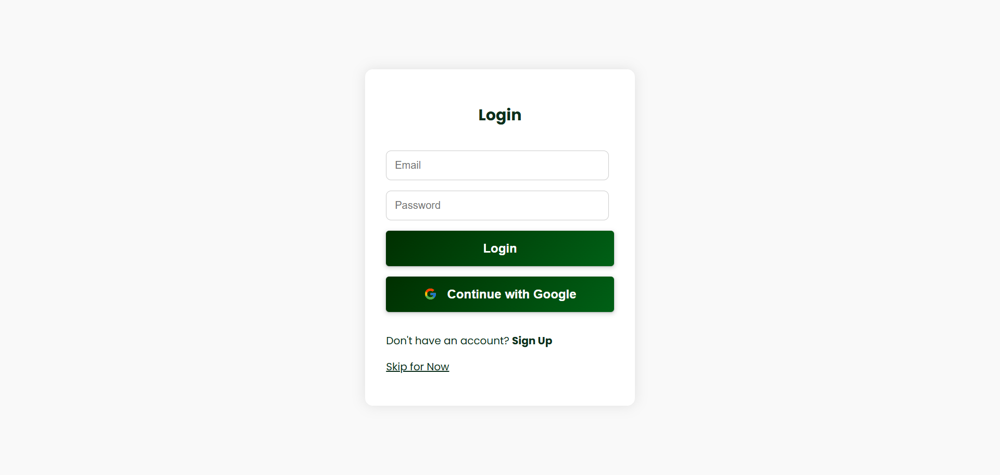
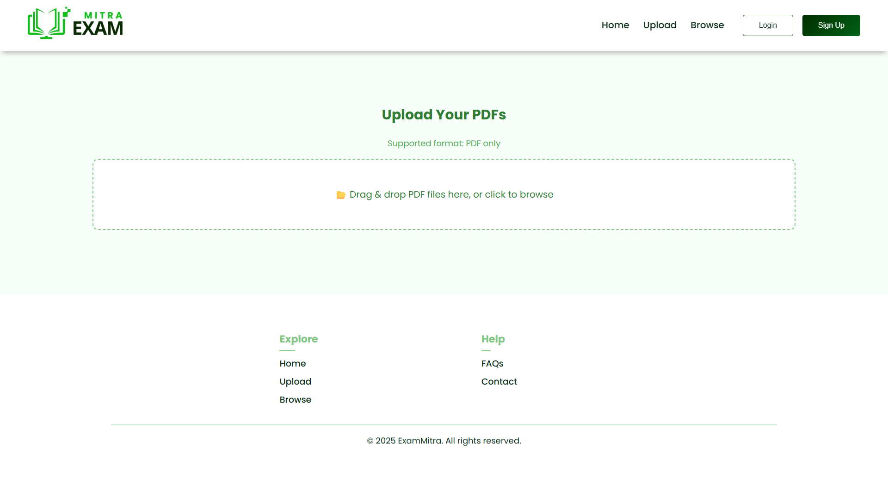
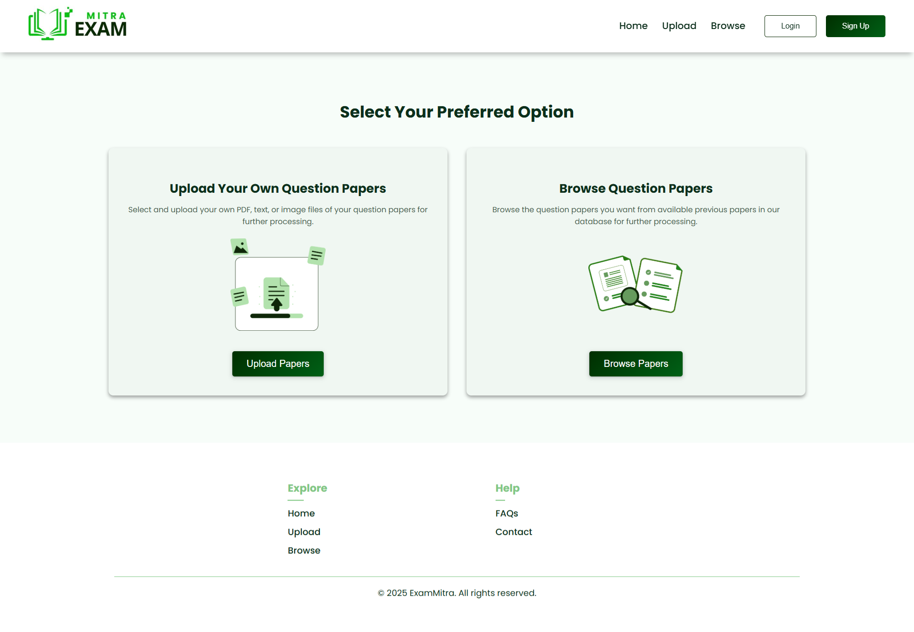
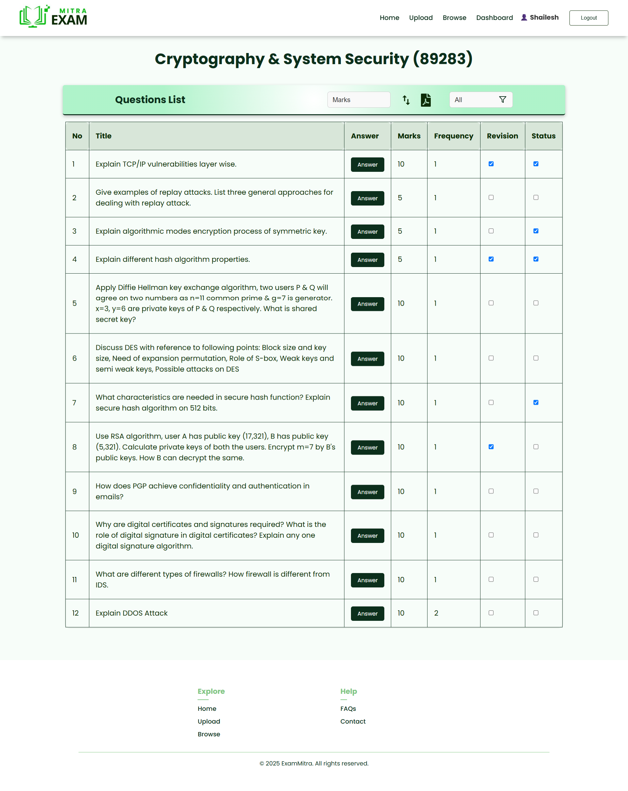
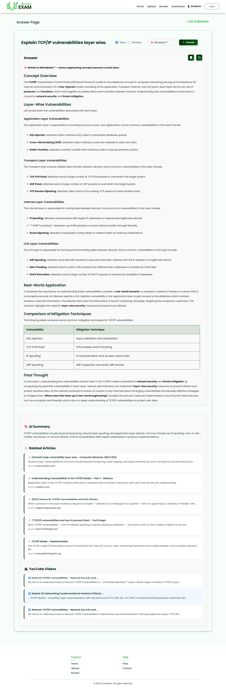
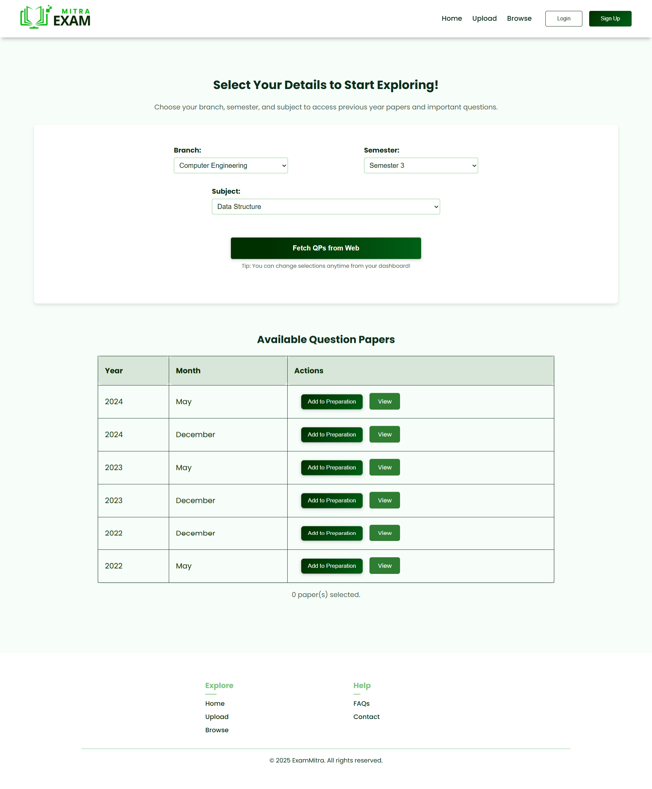
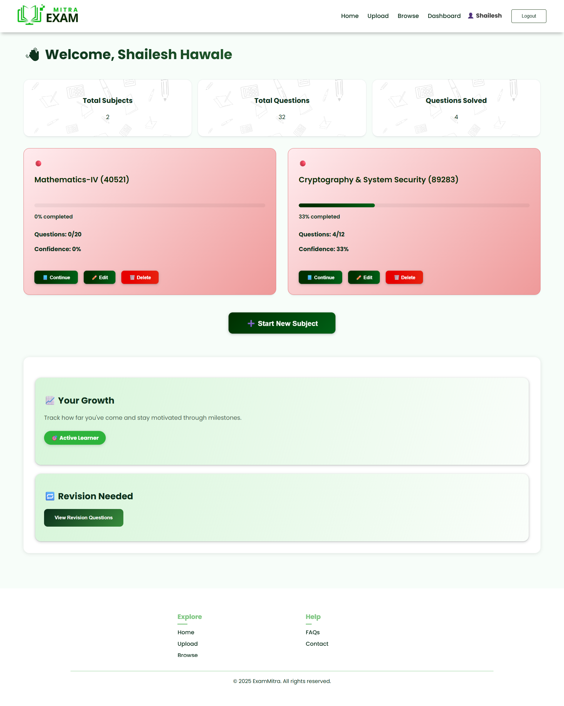

# 📘 ExamMitra – Your Smart Exam Companion

> AI-powered MERN stack platform to extract, organize, and revise exam questions – built for students who want to study smarter, not harder.


[](LICENSE)


---

## 📚 Table of Contents

- [Live Demo](#-live-demo)
- [Demo Video](#-demo-video)
- [Features](#-features)
- [Screenshots](#-screenshots)
- [Tech Stack](#-tech-stack)
- [Folder Structure](#-folder-structure)
- [Installation & Setup](#-installation--setup)
- [Environment Variables](#-environment-variables)
- [Why I Built This](#-why-i-built-this)
- [To-Do / Roadmap](#-to-do--roadmap)
- [Author](#-author)
- [License](#-license)

---

## 🔗 Live Demo  
🌐 https://exammitra-h.vercel.app/

---

## 🎥 Demo Video  
🎬 [Watch Full Demo Video](https://youtu.be/BAvnYzU2WVs)

---

## ✨ Features

### 📄 PDF Upload & Question Extraction
- Upload scanned or typed PDF question papers  
- Extract questions using **OCR (Puter.ai)** + **LLaMA 70B (via Groq API)**  
- Edit extracted questions and assign marks  

### 🧠 Smart Question Management
- Mark questions as **Done**, **Revision**, or **Pending**  
- Sort and filter questions by **marks**, **frequency**, and more  
- Edit or delete saved questions or question papers  

### 📝 AI-Powered Assistance
- Generate **answers in various ways** using LLM  
- Get additional **web insights** for deeper understanding  

### 📊 Progress Tracking & Organization
- Access personalized **dashboard** to track subjects and questions  
- View and manage all saved papers easily  

### 🔐 Authentication & Security
- Login via **Google OAuth** using Passport.js  
- Secure backend with JWT-based authentication  

### 🧾 Export & Sharing
- Export filtered questions and answers to **PDF** or **DOCX**  
- Send messages via integrated **contact form** (Nodemailer)

### 🌐 Database Integration
- Scraped university papers directly from **MUQuestionPapers.com**  
- Stored in MongoDB for faster Access

### 📚 Support & Help
- FAQ section to address common questions  
- Clean and intuitive UI with screenshot-guided interactions  


## 🖼️ Screenshots

| Landing Page | Login Page |
|--------------|----------------|
|  |  |

| Upload PDF | Select Option |
|-------------|------------------|
|  |  |

| Question Listing | Answer Page |
|--------------|-----------|
|  |   |

| Browse Papers | Dashboard |
|----------------|-------------|
|  |  |


---


## 🧱 Tech Stack

### Frontend
- React.js
- CSS  
- Axios, React Router

### Backend
- Node.js + Express.js  
- MongoDB + Mongoose   
- Puppeteer (Web Scraping) (Used Once to Scrap Data)
- Nodemailer (Email Support)
- Passport (Google OAuth)

### AI & Tools
- OCR: [Puter.ai](https://www.puter.ai/)  
- LLM: [LLaMA 70B via Groq API](https://groq.com/)  
- Deployment: Vercel (Frontend & Backend), MongoDB Atlas (DB)

---

#### Now that you know what ExamMitra can do, here's how the codebase is organized:


## 📁 Folder Structure

```
├── .gitignore
├── README.md                # Project documentation
│
├── exam-mitra-backend       # Backend (Express + MongoDB + Vercel)
│   ├── api/                 # Vercel entrypoint for serverless deployment
│   │   └── index.js
│   ├── config/              # Configuration files
│   │   └── dbConfig.js      # MongoDB connection setup
│   ├── controllers/         # Route handlers (business logic)
│   ├── middleware/          # Custom middleware
│   │   └── auth.js          # JWT/Auth validation
│   ├── models/              # Mongoose schemas & models
│   │   ├── Data/            # Static data models
│   │   │   ├── Course.js
│   │   │   ├── QuestionPaper.js
│   │   │   ├── Semester.js
│   │   │   └── Subject.js
│   │   └── User/            # User-related models
│   │       ├── Paper.js
│   │       ├── Question.js
│   │       └── User.js
│   ├── routes/              # API route definitions
│   ├── utils/               # Helper utilities
│   │   └── passportSetup.js # Passport.js Google OAuth config
│   ├── server.js            # Express app entry point
│   ├── package.json
│   └── vercel.json          # Vercel deployment config
│
├── exam-mitra-frontend      # Frontend (React + Vite)
│   ├── public/              # Static assets
│   │   ├── images/          # App icons, hero images, etc.
│   │   ├── index.html       # HTML entry point
│   │   ├── manifest.json
│   ├── screenshots/         # App screenshots for docs/demo
│   ├── src/                 # React source code
│   │   ├── App.js           # Root app component
│   │   ├── index.js         # React DOM entry
│   │   ├── CSS/             # Page/component styles
│   │   ├── components/      # UI Components (pages, forms, etc.)
│   │   └── utils/           # Helper functions (OCR, prompts, downloads)
│   ├── package.json
│   └── .gitignore
│
└── screenshots/             # General screenshots for README/demo

```

---

## ⚙️ Installation & Setup

1. Clone the repository  
```bash
git clone https://github.com/HawaleShailesh004/Exam-Mitra-MERN.git
```

2. Navigate into folders and install dependencies  
```bash
cd exam-mitra-frontend && npm install
cd ../exam-mitra-backend && npm install
```

3. Add required environment variables (see below)

4. Start the backend and frontend servers  
```bash
# In exam-mitra-backend
npm start   # Starts backend on http://localhost:5000 (or your configured port)

# In exam-mitra-frontend
npm run dev   # Starts frontend on http://localhost:3000 

```

---

## 🔐 Environment Variables
### 📦 Frontend (exam-mitra-frontend/.env.example)
```env
REACT_APP_GROQ_API_KEY=your_groq_api_key
REACT_APP_TAVILY_KEY=your_tavily_api_key
REACT_APP_API_BASE_URL=https://your-backend-url.com
```

### 📦 Backend (exam-mitra-backend/.env.example)
```env
# Database
MONGO_URI=your_mongodb_uri

# JWT Auth
JWT_SECRET=your_jwt_secret_key

# Google OAuth
GOOGLE_CLIENT_ID=your_google_client_id
GOOGLE_CLIENT_SECRET=your_google_client_secret
CLIENT_URL=https://your-frontend-url.com

# Groq AI
GROQ_API_KEY=your_groq_api_key

# Contact Email (for Nodemailer)
CONTACT_EMAIL=your_email@gmail.com
CONTACT_PASS=your_email_app_password

```

---

## 🧠 Why I Built This

As a student and developer, I saw how difficult and fragmented exam prep can be — from collecting PDFs to finding repeated questions and writing answers manually.  
**ExamMitra** combines OCR, LLMs, and smart tracking to streamline the entire prep process in one platform.

---


## ✅ To-Do / Roadmap
 
- Improve analytics with graphs & score tracking  
- Add bookmarking + topic-level filtering  
- Enable multi-university scraping  
- Add gamified revision scoring system  

---

## 👨‍💻 Author

**Shailesh Hawale**  
🔗 [LinkedIn](https://www.linkedin.com/in/shailesh-hawale)  
💻 [GitHub](https://github.com/HawaleShailesh004)   

> Open to feedback, collaboration & new opportunities!

---

## 📄 License

This project is open source under the [MIT License](LICENSE).
